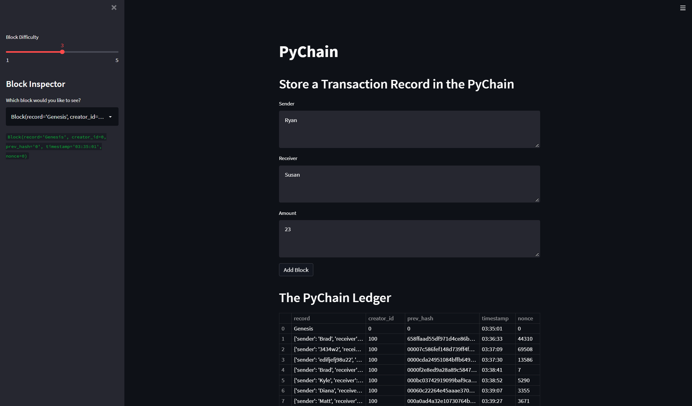
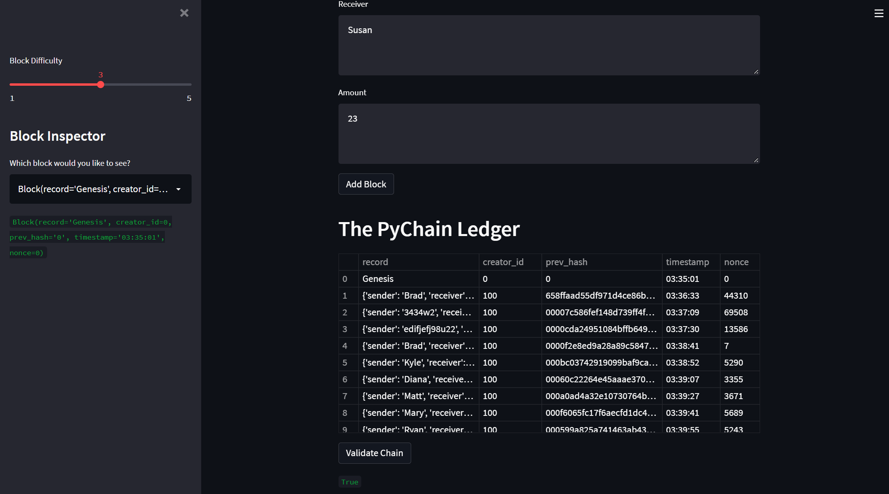

# Pychain Ledger

This script includes the creation of a blockchain based ledger system of transactions for deployment via Streamlit.

The application allows the user to input transactions (i.e., sener, receiver, and amount) for a non-specified currency. Initially, the only record showing in the ledger is the "Genesis" block by default, but the user can click "Add Block" to record transactions in subsequent blocks which are added to the ledger. The ledger is displayed at the bottom of the Streamlit application page.

Each line item in the ledger dispalys the transaction data, the creator id (set by default equal to 100 in this application), the hash of the previous block, the timestamp when the block was added, and the nonce for that block. If more difficulty is desired for each block, the sliding bar in the sidebar on the left hand side of the application can be adjusted - the higher the number, the more leading zeroes must be included in the current block's hash, thus increasing the diffulty (and also the nonce). 

A screenshot of the Streamlit application is displayed below, with mutliple transcations already added to the ledger.

At any point, the user can click the button to validate the transactions to ensure there has been no tampering with the ledger and that it is accurately keeping records. Validation is performed by checking each block's current hash against the previous hash of the next block. If they're equal, the blocks are valid and an output of "True" is returned to the user. If they're not equal, the blocks are not valid and an output of "False" is returned to the user.

